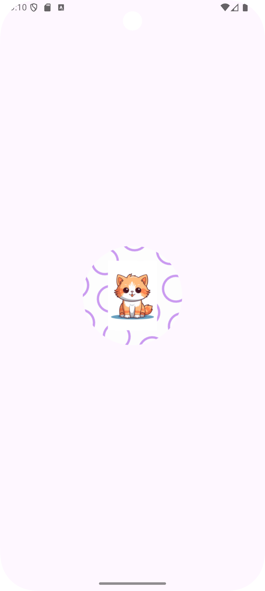
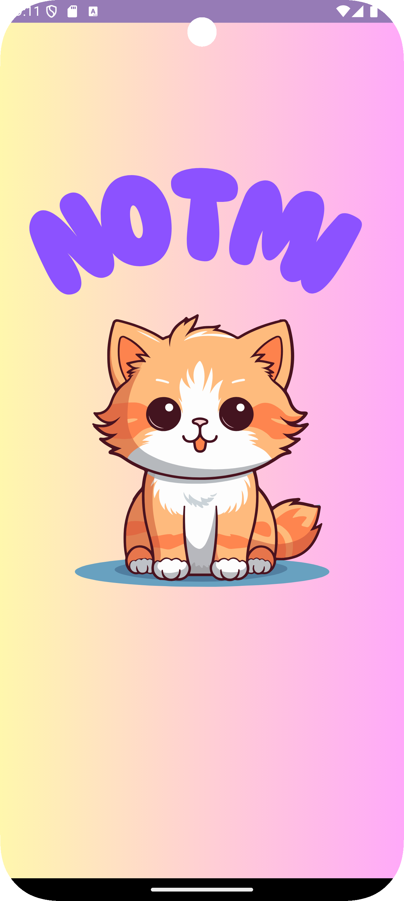
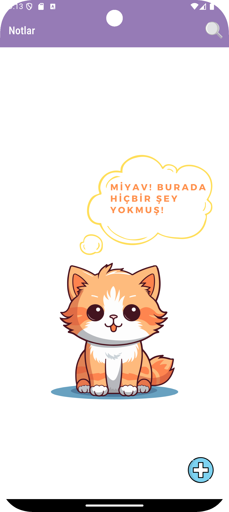
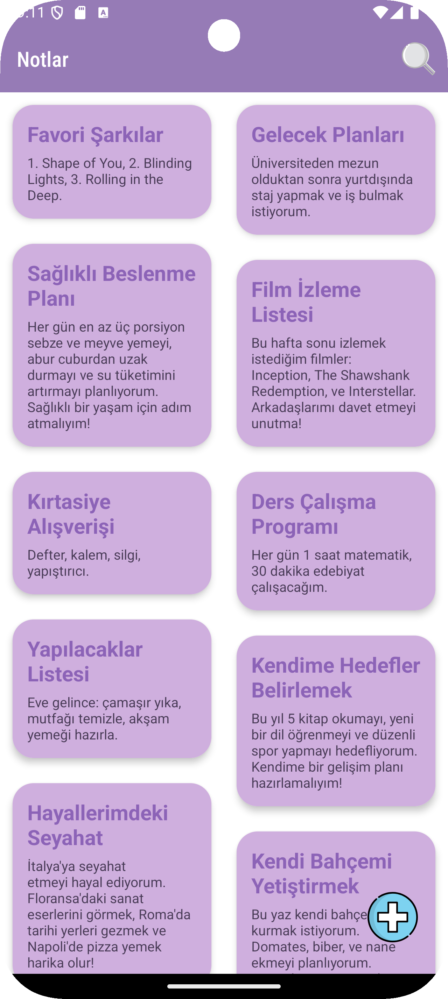
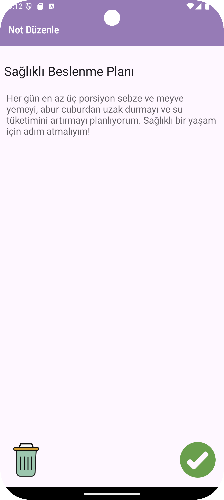
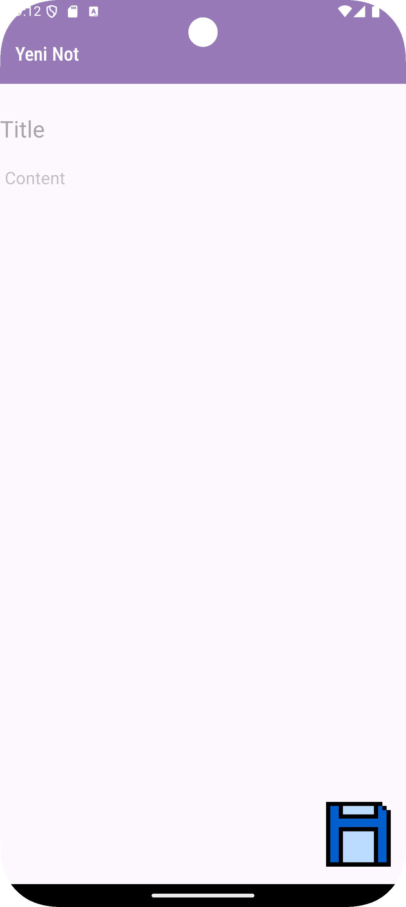

# <p align="center"> Notmi - Not Uygulaması </p>

## 📸 Screenshots
<table>
    <tr>
        <td align="center">
            <strong><h2>App Icon</h2></strong>
            
        </td>
        <td align="center">
            <strong><h2>Splash Screen</h2></strong>
            
        </td>
        <td align="center">
            <strong><h2>Empty Notes Screen</h2></strong>
            
        </td>
    </tr>
    <tr>
        <td align="center">
            <strong><h2>Notes List</h2></strong>
            
        </td>
        <td align="center">
            <strong><h2>Rename or Delete Note</h2></strong>
            
        </td>
        <td align="center">
            <strong><h2>Save Note</h2></strong>
            
        </td>
    </tr>
</table>


## :point_down: Kullanılan Yapılar
- MVVM + Clean Architecture
- Room
- Coroutines
- Flow
- Dagger Hilt
- Navigation Component
- Safe Args
- ViewBinding
- LiveData

## :pencil2: Bağımlılıklar

app build.gradle

```
plugins {
    alias(libs.plugins.android.application)
    alias(libs.plugins.kotlin.android)
    id("kotlin-kapt")
    id("com.google.dagger.hilt.android")
    id("androidx.navigation.safeargs")
}

android {
    namespace = "com.oktaygenc.notmi"
    compileSdk = 34

    defaultConfig {
        applicationId = "com.oktaygenc.notmi"
        minSdk = 28
        targetSdk = 34
        versionCode = 1
        versionName = "1.0"
        testInstrumentationRunner = "androidx.test.runner.AndroidJUnitRunner"
    }

    buildTypes {
        release {
            isMinifyEnabled = false
            proguardFiles(getDefaultProguardFile("proguard-android-optimize.txt"), "proguard-rules.pro")
        }
    }

    compileOptions {
        sourceCompatibility = JavaVersion.VERSION_11
        targetCompatibility = JavaVersion.VERSION_11
    }
    kotlinOptions {
        jvmTarget = "11"
    }
    buildFeatures {
        viewBinding = true
    }
}

dependencies {
    implementation(libs.androidx.core.ktx)
    implementation(libs.androidx.appcompat)
    implementation(libs.material)
    implementation(libs.androidx.activity)
    implementation(libs.androidx.constraintlayout)
    testImplementation(libs.junit)
    androidTestImplementation(libs.androidx.junit)
    androidTestImplementation(libs.androidx.espresso.core)

    implementation(libs.androidx.room.runtime)
    kapt(libs.androidx.room.compiler)
    implementation(libs.androidx.room.ktx)
    implementation(libs.androidx.room.paging)

    implementation(libs.hilt.android)
    kapt(libs.hilt.android.compiler)

    implementation(libs.androidx.lifecycle.viewmodel.ktx)
    implementation(libs.androidx.lifecycle.viewmodel.compose)
    implementation(libs.androidx.lifecycle.livedata.ktx)
    implementation(libs.androidx.lifecycle.runtime.ktx)

    implementation(libs.androidx.navigation.compose)
    implementation(libs.androidx.navigation.fragment)
    implementation(libs.androidx.navigation.ui)

    implementation(libs.kotlinx.coroutines.android)
}
```

project build.gradle
```
buildscript {
    repositories {
        google()
    }
    dependencies {
        classpath(libs.androidx.navigation.safe.args.gradle.plugin)
    }
}
plugins {
    alias(libs.plugins.android.application) apply false
    alias(libs.plugins.kotlin.android) apply false
    id("androidx.room") version "2.6.1" apply false
    id("com.google.dagger.hilt.android") version "2.51.1" apply false
}
```

